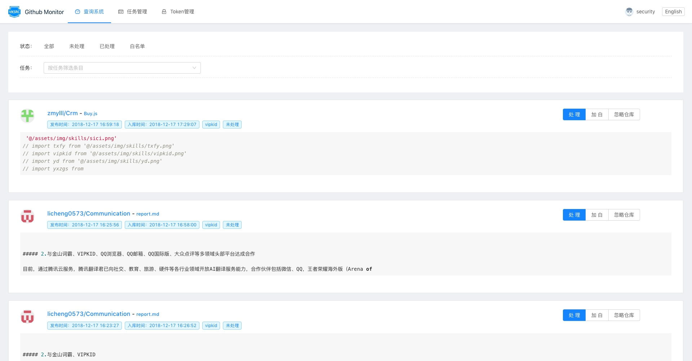
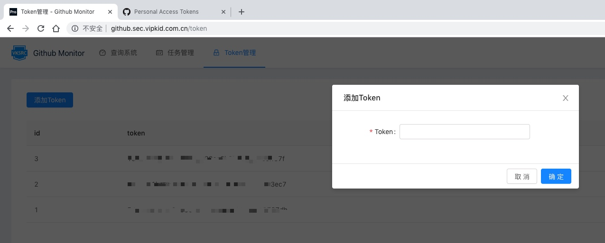
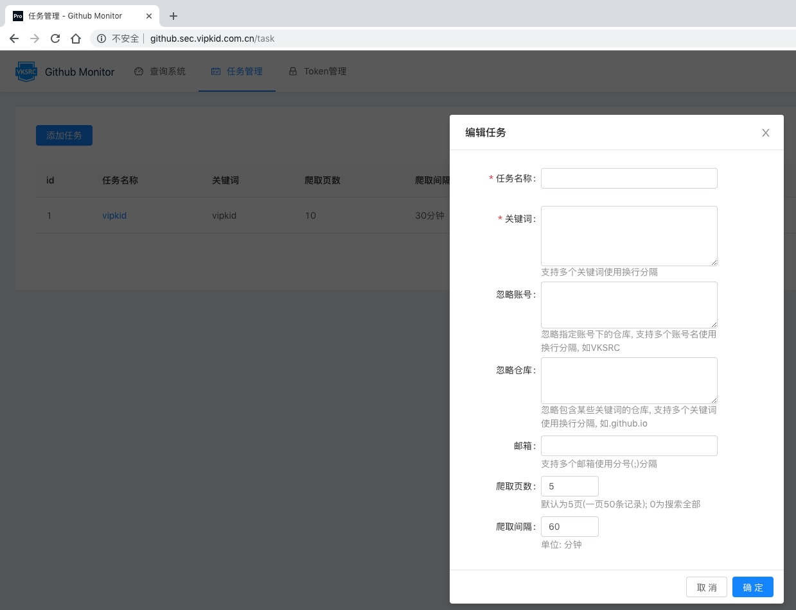
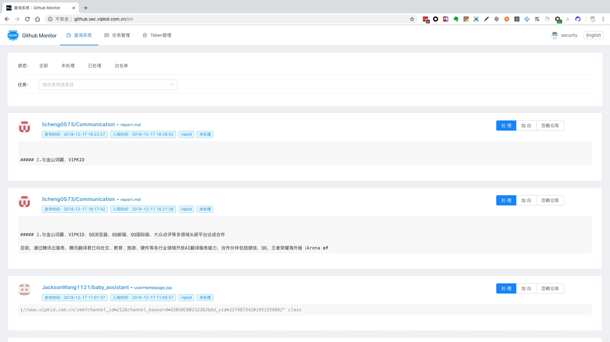

<div align="center">

# VIPKID GITHUB MONITOR




</div>

-----

**GITHUB MONITOR** is open-source software for providing an easy way to find out if there exists any leakage of sensitive information about your company on GitHub. Users can discover the leakages at minute level with some simple task configuration. The backend of this project is developed with **[django-rest-framework](https://www.django-rest-framework.org/)**, and the frontend with **[react](https://reactjs.org/)** and **[antd-pro](https://pro.ant.design/)**

## Features

* minute-level monitoring
* simple but flexible configuration
* E-Mail notification
* GitHub token management
* docker friendly
* stability

## Installation

Clone the repository to the local machine.

 ```
 git clone https://github.com/VKSRC/Github-Monitor.git
 ```

### 1. Docker-based deployment

We highly recommend you to deploy with docker, which is faster and easier.

You should install `Docker` and `docker-compose` before taking any future steps.

#### Modify the config files

Copy the `.env.docker` in the root directory and rename the new file as `.env`. Change the `Email Settings` and `initial Administrator` settings as needed. 

**Notice: If you want to run this system with a domain name other than `127.0.0.1` or `localhost`, you need to add your domain name into the `ALLOWED_HOST` parameter. For example, `ALLOWED_HOSTS="127.0.0.1,localhost,github.sec.vipkid.com.cn"`**
 
#### Start the Docker containers
 
```
docker-compose up -d
```

Visit `http://127.0.0.1:8001` and there you go.

**Notice: The initialization of the MySQL container may take about 30s before you can use the system.**
 
#### Change the port

If you want to run the system with another port, you can edit the `ports` of the `web` container in the file called `docker-compose.yml`.

The default port is `8001`. For example, if you want to change the port to 8080, you should change it from `8001:80` to `8080:80`.

### 2. Manual deployment

To get the system running, you should start your own **redis-server** before running other services.

----

Copy the `.env.sample` in the root directory and rename the new file as `.env`. Change the settings as needed. 

```
# Django Settings
DEBUG="True"  # Run Django in debug mode or not, Value: True/False
ALLOWED_HOSTS="*,127.0.0.1, localhost"  # Django Allowed_Hosts, if debug is false, then you need to add your own domain name in this list like mentioned before.

# Database Settings
# DATABASE choice is MySQL or SQLite
DATABASE="sqlite"  # database type: MySQL or SQLite.
DB_NAME="github"  # database name
DB_HOST="127.0.0.1"  # MySQL host
DB_PORT="3306"  # MySQL port
DB_USER="root"  # MySQL username
DB_PASSWORD="vipkid@2018"  # MySQL password

# Redis Settings
REDIS_HOST="127.0.0.1"  # redis host
REDIS_PORT="6379"  # redis port
REDIS_PASSWORD=""  # redis password

# Email Settings
# If you do not fill it in, it is None/False
EMAIL_HOST="smtp.example.com"  # smtp host
EMAIL_PORT="25"  # smtp port
FROM_EMAIL="secuirty@example.com"  # sender
EMAIL_HOST_USER="security@example.com"  # email user, leave blank if you want to send as anonymous
EMAIL_HOST_PASSWORD="password123!@#"  # email password, leave blank if you want to send as anonymous
EMAIL_USE_TLS="False"  # Use TLS encryption to communicate with the SMTP server, Value: True/False
EMAIL_USE_SSL="False"  # Use SSL encryption to communicate with the SMTP server, Value: True/False

# initial Administrator
INIT_ADMIN_USERNAME="admin"  # Username when initializing the system
INIT_ADMIN_PASSWORD="password123!@#"  # Password when initializing the system
```

- Deploy the backend code:

> For a test environment, you can start the server with `python manage.py runserver` command. For a production environment, we recommend you to use uwsgi and Nginx. There are some example configuration files in [Configure](./conf) directory.

1. Change directory into `server`
2. Setup virtualenv (recommend)
3. Create MySQL database (Ignore this step if you want to SQLite as database)
 > Create the database you want to save data of this system by running 
 > `CREATE DATABASE IF NOT EXISTS GitHub DEFAULT CHARSET utf8mb4 COLLATE utf8mb4_bin;`
 > after logging in to MySQL.
4. run the following scripts:

```
# Install the python dependencies
pip3 install -r requirements.pip -i http://pypi.doubanio.com/simple --trusted-host pypi.doubanio.com
# Initialize the database structure
python3 manage.py migrate
# Initialize the admin account
python3 manage.py init_admin
# Start the web backend
python3 manage.py runserver 127.0.0.1:8001
# Start the monitor task service
python3 manage.py monitor_task_service
```

----

- Deploy the frontend code:

> For a test environment, you may start the server by `npm run start`. For a production environment, you can generate the static files by `npm run build` and host these files with Nginx.

1. Change directory into `client`
2. If the address of the backend isn't `127.0.0.1:8001`, then you need to modify `target` to your customized address in `config/config.local.js`.
3. Run `npm install && npm run start`

## Configuration

### 1. Add Github Token

Github Monitor uses Github REST API v3 interface to search for the leaked information, so you should add some Token for API authorization before gathering the required information.

1. Log in to Github, go to [Personal access tokens](https://github.com/settings/tokens) to create a new token.
2. Add the tokens into Github Monitor.


**Notice: Github API has a rate limit (30 requests/minute), you can add multiple tokens in the system to raise the speed.**

### 2. Add monitor tasks



- Task name: a marker for the task.
- Keyword: Support multiple keywords and [Github REST API v3 search code](https://developer.github.com/v3/search/#search-code). For example: `extension:java`, only search for the files with `java` extension.
- Ignored usernames: Fuzzy matching is **NOT** supported. Each line contains one username.
- Ignored repos: Support fuzzy matching. For example: `github.io` will ignore repos like `test.github.io` and `vipkid.github.io`.
- Email: Leave blank if you don't need email notification.
- Crawl pages: Default is 5 pages, and each page contains 50 items.
- Crawl Internal: Default is 60 minutes, change as you needed.


### 3. Confirm/Ignore the risk

Screenshot: 



The data gathered will be saved to the database, you can use `Search System` to perform different actions.

- Solved: Confirm there exists some risk need further solutions.
- Add Whitelist: Confirm there doesn't exist any risk. Won't notify until the file is modified.
- Ignore Repo: Add all information in that repo into the whitelist.

## Contact Us

Follow us on WeChat.


If you find some bugs or want to request some new features, you can tell us both by WeChat or creating a new issue.